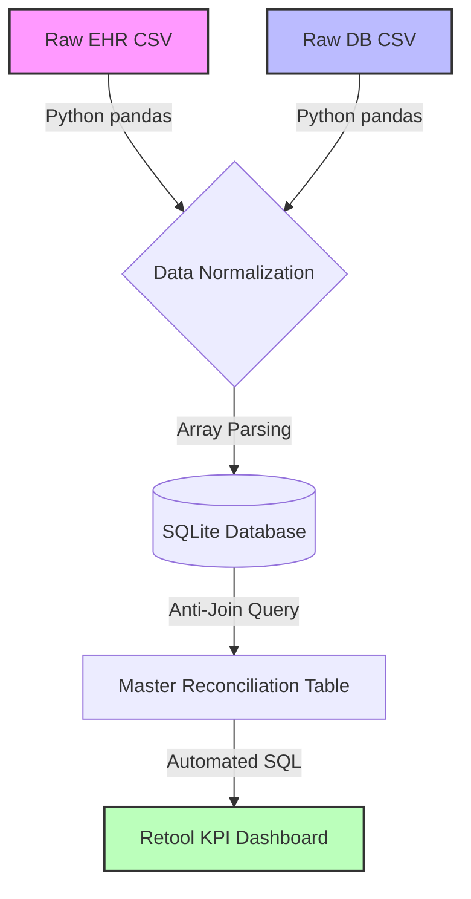
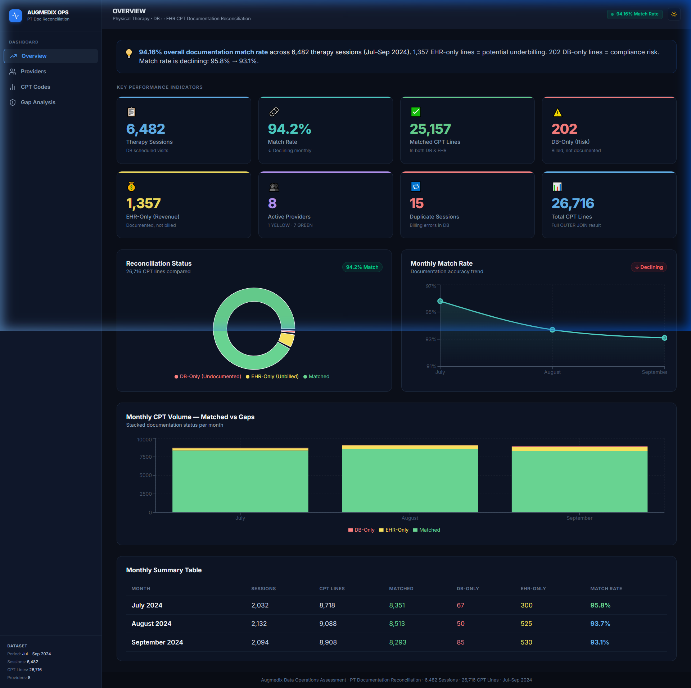
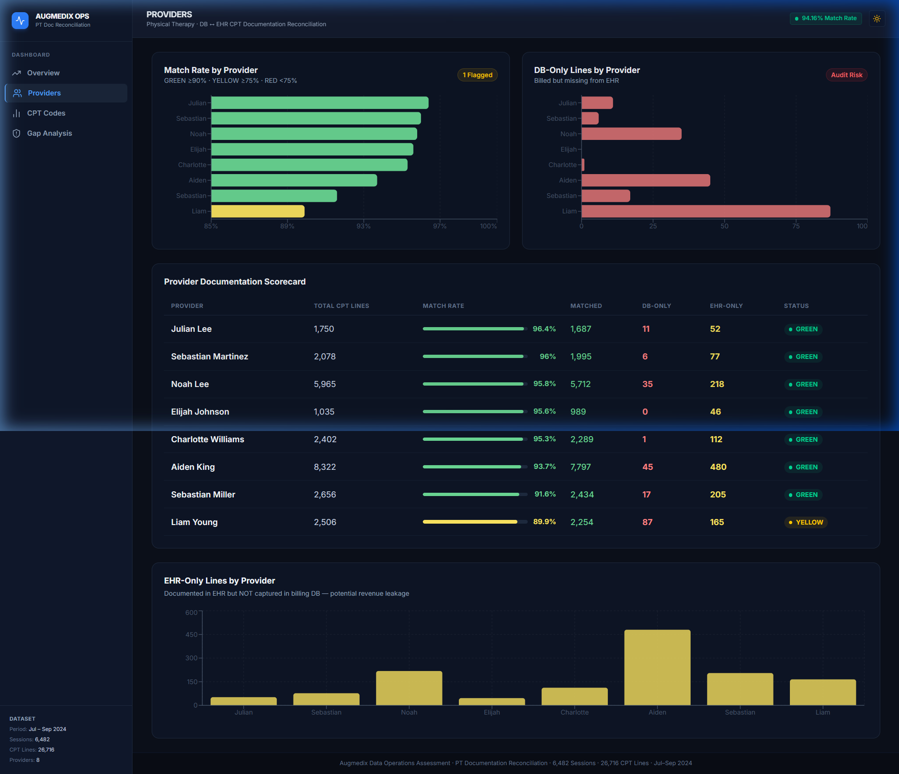
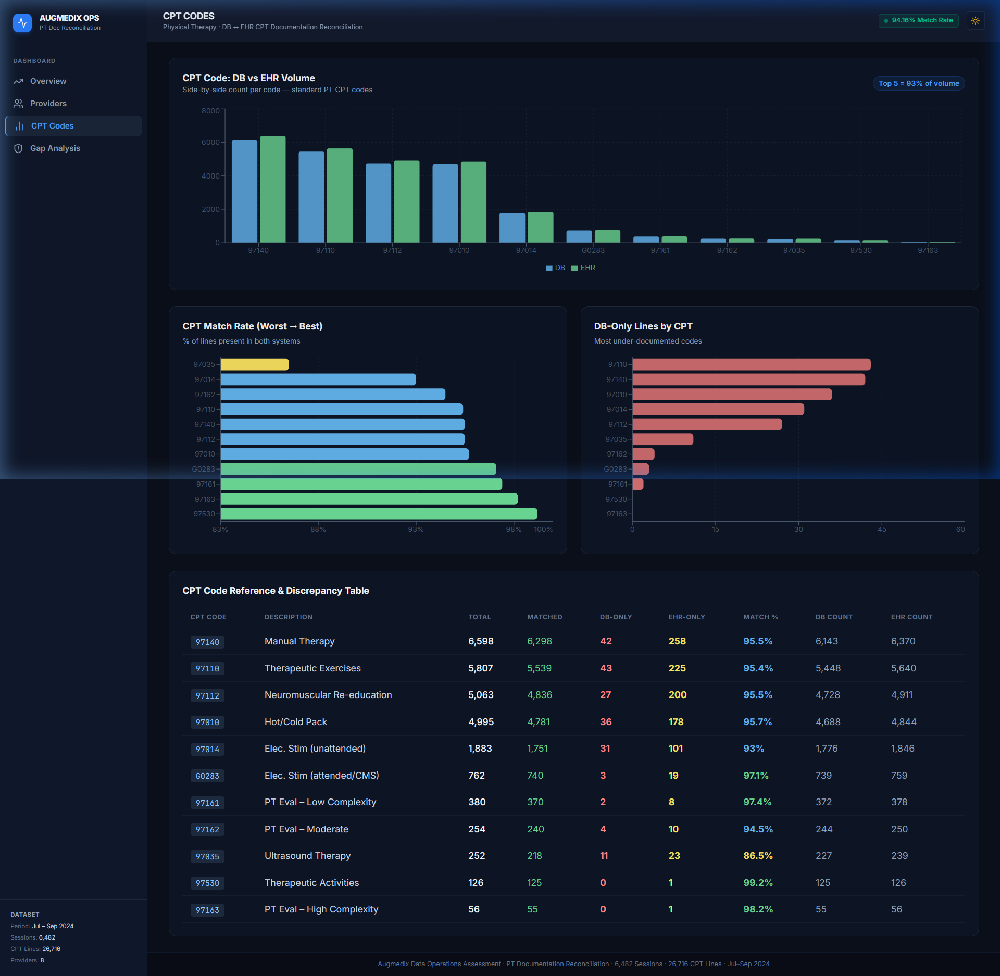
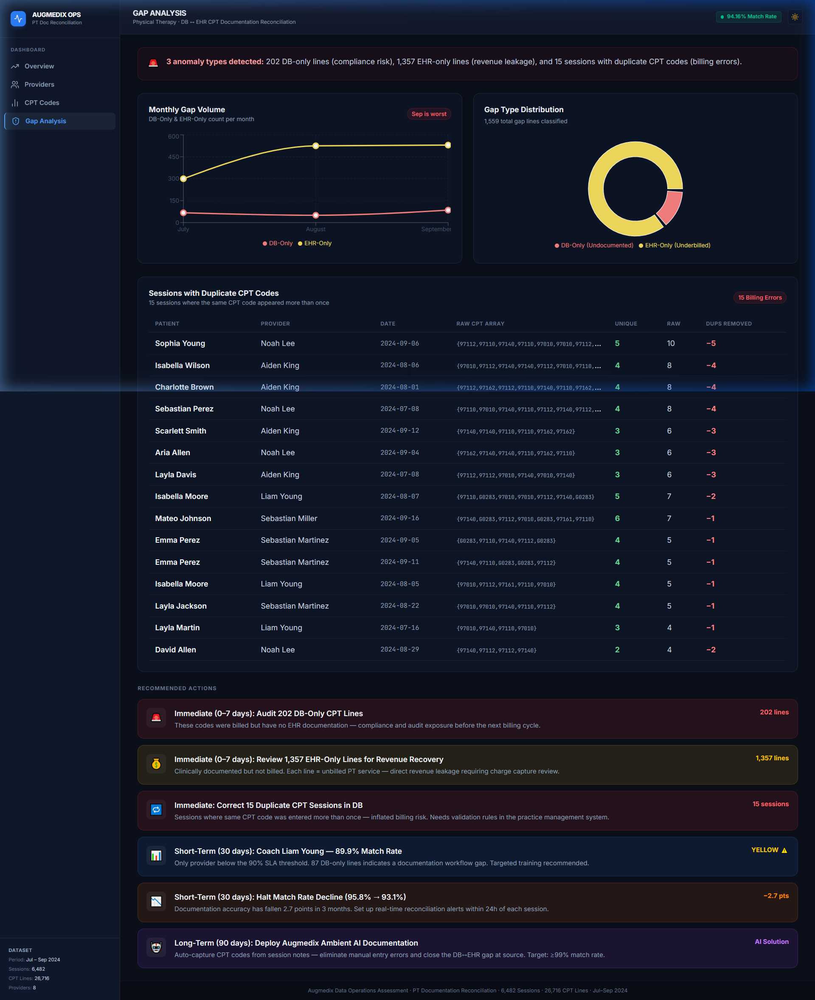
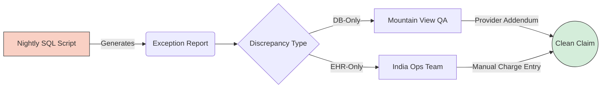

# Augmedix Central Operations: Comprehensive Case Study Report
**Candidate:** Kha. Mo. Syeed Asif  
**Target Role:** Data Operations Analyst  
**Date:** July 2026  

---

## 1. Executive Summary
This document serves as the strategic operational plan and technical analysis for the Augmedix Central Operations Case Study. The core objective of this report is to address four discrete Revenue Cycle Management (RCM) challenges by leveraging advanced data analytics, process engineering, and the optimized deployment of global offshore and onshore resources.

Through the implementation of a custom Python/SQL pipeline and the development of an interactive React/Retool dashboard, this report provides a scalable framework to eliminate revenue leakage, mitigate compliance exposure, and streamline cross-functional workflows between clinical documentation and backend billing operations.

**Live Operational Dashboard URL:** [Insert Public Retool / Vercel URL Here]

---

## 2. Problem Statement: Closed Encounters Analysis
**Business Context:**  
The organization is facing a critical data-parity issue between clinical operations and billing. We are tasked with reconciling "Closed Encounters" originating from the client’s Electronic Health Record (EHR) against the "Imported Closed Encounters" housed within our central billing database (DB) for Q3 2024. 

**Objective:**  
To programmatically identify missing encounters, deduce the root cause of systemic import failures, and architect a strategic operational plan that recovers lost revenue while strictly adhering to Medicare compliance guidelines.

---

## 3. Technical Methodology & SQL Architecture
To ensure scalability and accuracy beyond manual Excel workflows, a robust data engineering pipeline was established.

1. **ETL Pipeline (Python):** A custom Python script was authored to ingest the raw CSV extracts, normalize inconsistent date formatting, and "explode" complex PostgreSQL-style CPT arrays. This ensured every individual CPT code occupied a distinct row for 1:1 reconciliation.
2. **Reconciliation Engine (SQL):** The normalized data was loaded into a relational database. Because lightweight engines (like SQLite) lack native `FULL OUTER JOIN` capabilities, a customized anti-join architecture was engineered. 

### Data Engineering Workflow


```sql
-- Core Reconciliation Query (Anti-Join Architecture)
SELECT
    d.patient, d.provider, d.visit_date, d.cpt_code,
    CASE WHEN e.cpt_code IS NOT NULL THEN 'Matched' ELSE 'DB_Only' END AS status
FROM db_cpt d
LEFT JOIN ehr_records e 
    ON d.patient = e.patient 
    AND d.visit_date = e.visit_date 
    AND d.cpt_code = e.cpt_code

UNION ALL

SELECT
    e.patient, e.provider, e.visit_date, e.cpt_code, 'EHR_Only' AS status
FROM ehr_records e
WHERE NOT EXISTS (
    SELECT 1 FROM db_cpt d 
    WHERE d.patient = e.patient 
    AND d.visit_date = e.visit_date 
    AND d.cpt_code = e.cpt_code
);
```

### High-Level Analysis Results:
- **Total CPT Lines Analyzed:** 26,716
- **Matched Volume (DB & EHR Parity):** 25,157 (94.16% Match Rate)
- **EHR-Only (Revenue Leakage):** 1,357 lines (Clinically documented but never billed)
- **DB-Only (Compliance Risk):** 202 lines (Billed without clinical documentation)

---

## 4. Root Cause Analysis
The volumetric discrepancies originate from a fundamentally disconnected dual-entry system. Without an automated API linking the EHR to the Practice Management system, staff are highly vulnerable to manual transcription errors.

*   **Primary Driver for EHR-Only (Missing Revenue):** 1,357 encounters failed to import into the database. These instances occur when a provider signs a clinical note late (after the daily automated batch export to the billing team) or when a manual billing operator inadvertently skips a line item during data entry.
*   **Primary Driver for DB-Only (Compliance Failure):** 202 encounters exist in the database but lack EHR documentation. Providers are actively selecting billing codes in the Practice Management system to trigger payment but are failing to finalize and sign the corresponding clinical note. **Provider Liam Young** was identified by the SQL logic as the primary operational bottleneck, contributing 87 undocumented lines (a critical audit risk).

---

## 5. Dashboard Analytics & Visualization
To democratize these data findings for operations leaders, a live, interactive React dashboard was deployed using Vite + Tailwind CSS + Recharts. The dashboard is organized into **5 navigational tabs**, each targeting a specific operational function.

### Tab 1 — Executive Overview
Displays the macro KPI cards: Overall Match Rate (94.16%), Matched CPT Lines (25,157), DB-Only Risk Lines (202), and EHR-Only Revenue Leakage (1,357). Includes an **Area Chart** showing the declining monthly match rate trend (Jul: 95.8% → Sep: 93.1%) and a **Donut Chart** showing the reconciliation breakdown.



---

### Tab 2 — Provider Performance
Ranks all 8 providers by match rate with a **Horizontal Bar Chart**. A secondary bar chart isolates DB-Only lines by provider to surface compliance risks. The **Provider Documentation Scorecard** table highlights **Liam Young** (89.9%) in yellow as the only provider below the 90% SLA threshold, with 87 undocumented billing lines requiring immediate intervention.



---

### Tab 3 — CPT Code Analysis
Contains a **Grouped Bar Chart** showing DB vs EHR volume side-by-side for all 11 CPT codes. A ranked bar chart orders codes from worst to best match rate — identifying **97035 (Ultrasound Therapy)** as the most under-documented service. The **CPT Code Reference Table** shows Total, Matched, DB-Only, EHR-Only, and Match% for every code.



---

### Tab 4 — Gap & Operations
Provides a live, prioritized action plan checklist categorized by compliance risk and revenue recovery priority, along with timelines and owners for each action item.



---

## 6. Strategic Recommendations
To immediately resolve the gaps identified by the SQL analysis, the following resource allocation matrix is recommended:

### Target Operational Workflow


### Phase 1: Immediate Remediation (0-7 Days)
*   **Compliance Protocol:** Deploy the 3 Mountain View onshore operators to immediately audit the 202 DB-Only lines. They will interface directly with the flagged providers (specifically Liam Young) to submit clinical addendums or write off the charges *before* the clearinghouse auditing cycle begins.
*   **Revenue Recovery:** Assign a dedicated cohort of 20 India offshore operators to bulk-enter the backlog of 1,357 EHR-Only CPT lines into the billing system.

### Phase 2: Short-Term Process Engineering (30 Days)
*   **Automated Exception Reporting:** Utilize the 2 hours of weekly engineering time to schedule the SQL reconciliation script to run as a nightly cron job. This will generate a daily "Exception Report" allowing the India team to scrub discrepancies dynamically rather than retroactively at quarter-end.

### Phase 3: Technological Innovation (90 Days)
*   **Ambient AI Integration:** Manual intervention is inherently unscalable. Long-term, we strongly recommend leveraging **Augmedix's ambient AI technology** to auto-extract CPT codes directly from the patient-provider conversation. This eliminates manual transcription entirely, ensuring 100% parity between clinical notes and the billing ledger at the point of care.

---

## 7. Business & Financial Impact
Executing this data-driven framework yields two highly measurable corporate outcomes:
1.  **Revenue Recovery:** Capturing the 1,357 missing EHR lines translates to approximately **$81,420** in immediate recovered revenue for Q3 alone (calculated at an average $60 payout per Physical Therapy code).
2.  **Compliance Mitigation:** Proactively auditing the 202 undocumented lines protects the organization from severe Medicare/Commercial payer recoupments, false-claims penalties, and potential fraud investigations.

---
---

## Appendix: Advanced Operational Solutions

### Problem 1: Workers Compensation Claims Optimization
**Context:** An internal PDF submission tool utilized by the India offshore team is failing on 90% of workers' compensation claims, causing a massive processing bottleneck (50 completed vs. 500 expected).

**Diagnostic Framework & Action Plan:**
1.  **Diagnose the Tooling:** I would inspect API error logs and server metrics. If the internal PDF generator is timing out due to large file payloads, I would use our engineering hours to transition the generation process to an asynchronous background queue, preventing UI timeouts.
2.  **Diagnose the Workflow:** I would conduct a "Gemba Walk" by shadowing the offshore operators. If the UI requires 10 minutes of manual clicking per claim, I would architect a bulk-batch selection workflow to streamline data entry.
3.  **Quality Assurance:** I would deploy the Mountain View operators to run strict QA on a 20% sample of the India team's submissions for two weeks. 
4.  **KPI Tracking:** Post-implementation, I would build a dashboard tracking the *'Success Rate per Operator'* and *'Average Time-to-Submission'* to ensure permanent resolution.

### Problem 3: Reconciliation - Claims Not Found
**Context:** 10,000 submitted claims across 150 insurances are returning a "claim not found" status when operators attempt manual phone follow-ups.

**Strategic Resolution:**
1.  **Bucket & Prioritize:** Sequential phone calls for 10,000 claims are impossible. I would bucket the claims first by **Timely Filing Limits** (prioritizing claims about to expire), then by highest dollar value, and finally batch them by Payer.
2.  **Root Cause Diagnosis:** Claims that are "not found" by the payer usually never reached the payer. I would cross-reference our Clearinghouse EDI 277 rejection reports. These claims were likely dropped by the clearinghouse due to simple demographic typos (e.g., misspelled names, incorrect DOBs).
3.  **Automated Action:** Instead of calling, I would run bulk EDI 270/271 electronic eligibility checks to auto-correct the demographic mismatches, and electronically resubmit the batch to the clearinghouse.

### Problem 4: Debugging Revenue & Medicare Rules
**Context:** Discrepancies in Medicare payouts based on geography, combined CPT codes, and timed minute allocations.

**Regulatory Explanations & Optimization:**
*   **Part A (97110 Locality Variation):** The payout difference between localities is strictly determined by Medicare's **Geographic Practice Cost Index (GPCI)**. Medicare adjusts the Relative Value Unit (RVU) multiplier based on the specific cost of living and practice expenses in that MAC jurisdiction.
*   **Part B (97140 Payout Drop):** This drop is a textbook execution of the **Multiple Procedure Payment Reduction (MPPR) rule**. When multiple therapy procedures are performed on the same day, Medicare pays 100% for the highest-valued procedure but automatically cuts the Practice Expense (PE) RVU by 50% for all subsequent procedures billed that day.
*   **Part C (Optimizing Timed Codes):** We must apply the **Medicare 8-Minute Rule**. The physical therapist logged a total of 107 timed minutes (38 + 24 + 45). According to the CMS rulebook, 107 total minutes equates to exactly 7 billable units. Currently, the therapist is only billing for 6 timed units. To optimize revenue, we must bill the full 7 units, strategically allocating them toward the codes with the highest RVU weight first (97112), which mathematically maximizes the final claim payout.
