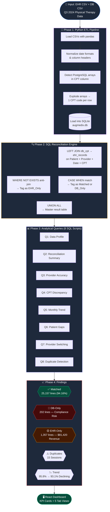
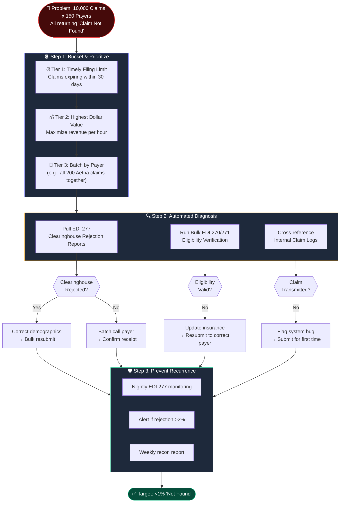
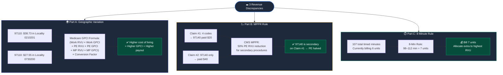

# Augmedix Central Operations Case Study
## Project Report: Thought Process & Solution Architecture

---

| Field | Detail |
|---|---|
| **Author** | Kha. Mo. Syeed Asif |
| **Position Applied** | Data Operations Analyst |
| **Submitted To** | Commure / Augmedix Operations Team |
| **Date** | July 2026 |
| **Report Version** | 1.0 — Final |

---

## Table of Contents

1. [Project Objective](#1-project-objective)
2. [Problem 1 — Workers Compensation Claims](#2-problem-1--workers-compensation-claims)
3. [Problem 2 — Closed Encounters Reconciliation](#3-problem-2--closed-encounters-reconciliation)
4. [Problem 3 — Reconciliation: Claims Not Found](#4-problem-3--reconciliation-claims-not-found)
5. [Problem 4 — Debugging Revenue](#5-problem-4--debugging-revenue)
6. [Dashboard Design Rationale](#6-dashboard-design-rationale)
7. [Key Principles Applied](#7-key-principles-applied)
8. [Final Conclusion & Business Outcomes](#8-final-conclusion--business-outcomes)

---

## 1. Project Objective

This report documents the complete analytical methodology, decision rationale, and solution architecture applied to the Augmedix Central Operations Case Study. The case study presented four distinct Revenue Cycle Management (RCM) challenges requiring a combination of process diagnostics, data engineering, domain-specific billing expertise, and strategic resource planning.

The primary deliverables produced during this engagement are:
- A programmatic Python/SQL reconciliation pipeline (Problem 2)
- An interactive React dashboard for operational stakeholders
- A structured operational action plan with resource allocation
- Written strategic analyses for Problems 1, 3, and 4

---

## 2. Problem 1 — Workers Compensation Claims

### 2.1 Problem Definition
An internal PDF submission tool operated by the India offshore team is experiencing a **90% failure rate**. Of the expected 500 daily claims, only 50 are completed successfully.

### 2.2 Solution Architecture


### 2.3 Diagnostic Approach

A 90% failure rate indicates a **systemic issue**, not an individual performance gap. The diagnostic methodology follows a structured **5-Why + Gemba Walk** framework executed in parallel — not sequentially — to compress resolution time from days to hours.

| Diagnostic Track | Method | Expected Finding |
|---|---|---|
| **Tooling** | Review API error logs and server metrics | Timeout errors, payload size rejections, vendor API outages |
| **Workflow** | Virtual Gemba Walk — shadow 3 operators live | UI bottlenecks, excessive manual clicks, missing field confusion |
| **Data** | A/B comparison of 50 successful vs. 450 failed payloads | Isolate the differentiating variable (e.g., insurer, file size, state) |

**Key insight:** The 10% success rate is diagnostically valuable. The system *can* work under specific conditions. The objective is to identify those conditions and make them the default processing path for all 500 claims.

### 2.4 Resolution Framework

| Root Cause | Solution | Owner | Timeline |
|---|---|---|---|
| PDF generation timeout | Migrate to asynchronous background queue | Engineering (2 hrs/week) | Week 1 |
| Payload size exceeds vendor limit | Implement automatic PDF compression | Engineering (2 hrs/week) | Week 1 |
| Missing required fields | Add pre-submission validation with user warnings | Engineering (2 hrs/week) | Week 2 |
| Inefficient UI workflow | Implement bulk-batch claim selection | Engineering (2 hrs/week) | Week 2 |
| Operator training gap | Publish rigid SOP with visual step-by-step screenshots | Mountain View QA Team | Week 1 |

### 2.5 Post-Implementation KPI Tracking

| Metric | Target | Measurement Frequency |
|---|---|---|
| Daily Success Rate | ≥ 98% (490+/500) | Daily automated dashboard |
| Average Time-to-Submission per Claim | < 3 minutes | Weekly review |
| Success Rate by Individual Operator | ≥ 95% per operator | Weekly review |
| Error Category Distribution | Monitor for new failure modes | Weekly review |

---

## 3. Problem 2 — Closed Encounters Reconciliation

### 3.1 Problem Definition
Two datasets — Closed Encounters from the client's EHR and Imported Closed Encounters from our billing database — must be reconciled to identify missing encounters and determine root causes for import failures during Q3 2024.

### 3.2 Solution Architecture



### 3.3 Technology Selection Rationale

| Decision | Rationale |
|---|---|
| **Python over Excel** | The DB export contained PostgreSQL-style CPT arrays (e.g., `{97110, 97140, 97112}`) that require programmatic parsing. Excel cannot reliably "explode" arrays into individual rows. Additionally, a Python script is reproducible — any analyst can re-run it at quarter-end in one click. |
| **SQL over manual comparison** | Set-based JOIN logic is deterministic, auditable, and precise. The same query always returns the same answer — unlike manual Excel VLOOKUP comparisons which are error-prone at 26,000+ row scale. |
| **SQLite over PostgreSQL** | The dataset is small enough to run locally without server infrastructure. This reduces deployment friction for the assessment. |
| **Anti-Join over FULL OUTER JOIN** | SQLite does not natively support `FULL OUTER JOIN`. The equivalent `LEFT JOIN + UNION ALL + WHERE NOT EXISTS` pattern is mathematically identical and portable across database engines. |

### 3.4 Core SQL Logic

```sql
-- Part 1: Identify Matched and DB-Only records
SELECT d.patient, d.provider, d.visit_date, d.cpt_code,
    CASE WHEN e.cpt_code IS NOT NULL THEN 'Matched' ELSE 'DB_Only' END AS status
FROM db_cpt d
LEFT JOIN ehr_records e
    ON d.patient = e.patient AND d.visit_date = e.visit_date AND d.cpt_code = e.cpt_code

UNION ALL

-- Part 2: Identify EHR-Only records via anti-join
SELECT e.patient, e.provider, e.visit_date, e.cpt_code, 'EHR_Only' AS status
FROM ehr_records e
WHERE NOT EXISTS (
    SELECT 1 FROM db_cpt d
    WHERE d.patient = e.patient AND d.visit_date = e.visit_date AND d.cpt_code = e.cpt_code
);
```

### 3.5 Analysis Results

| Metric | Value | Business Implication |
|---|---|---|
| Total CPT Lines Analyzed | 26,716 | Full Q3 2024 scope |
| Matched (DB ∩ EHR) | 25,157 (94.16%) | System parity baseline |
| EHR-Only (Revenue Leakage) | 1,357 lines | ~$81,420 unbilled revenue |
| DB-Only (Compliance Risk) | 202 lines | Billed without clinical documentation |
| Duplicate CPT Sessions | 15 sessions | Inflated billing risk |
| Monthly Match Rate Decline | 95.8% → 93.1% | Systemic process degradation |
| Lowest-Performing Provider | Liam Young (89.9%) | Below 90% SLA threshold — 87 DB-only lines |

### 3.6 Root Cause Analysis

| Category | Volume | Root Cause |
|---|---|---|
| **EHR-Only** | 1,357 | Providers sign clinical notes after the daily batch export, or billing operators miss transcribing the CPT code during manual data entry. |
| **DB-Only** | 202 | Providers select billing codes in the Practice Management system but fail to finalize and sign the corresponding clinical note in the EHR. |
| **Declining Trend** | −2.7 pts | The gap is accelerating month-over-month, indicating a worsening systemic process failure, not a one-time backlog. |

### 3.7 Operational Action Plan

| Phase | Timeline | Action | Owner | Resources |
|---|---|---|---|---|
| **Phase 1** | Days 0–7 | Audit 202 DB-Only lines; submit clinical addendums | Mountain View Team | 3 onshore operators |
| **Phase 1** | Days 0–7 | Bulk-enter 1,357 EHR-Only lines into billing | India Offshore Team | 20 operators |
| **Phase 1** | Days 0–3 | Correct 15 duplicate CPT sessions | Mountain View Team | 1 operator |
| **Phase 2** | Days 8–30 | Automate nightly SQL cron job → Exception Report | Engineering | 2 hrs/week |
| **Phase 2** | Days 8–14 | Targeted coaching session with Liam Young | Mountain View Team | 1 operator |
| **Phase 3** | Days 31–90 | Deploy Augmedix Ambient AI for auto-CPT capture | Engineering + Product | Cross-functional |

---

## 4. Problem 3 — Reconciliation: Claims Not Found

### 4.1 Problem Definition
10,000 submitted claims across 150 insurance payers are returning a "claim not found" status during the reconciliation process. The current resolution method (individual phone calls) is operationally unsustainable.

### 4.2 Solution Architecture



### 4.3 Prioritization Framework

| Priority Tier | Criteria | Rationale |
|---|---|---|
| **Tier 1: Timely Filing** | Claims within 30 days of payer deadline | Permanent denial after expiration — irreversible revenue loss |
| **Tier 2: Dollar Value** | Sort descending by claim amount | Maximize revenue recovered per hour of operator time |
| **Tier 3: Payer Batch** | Group by insurance company | Calling 30 Aetna claims in one session is 10x more efficient than random order |

### 4.4 Diagnosis Before Phone Calls

The critical insight is: **"Claim Not Found" almost always means the claim never arrived at the payer.** Before placing a single phone call, I would execute automated electronic diagnostics:

| Diagnostic Tool | What It Reveals |
|---|---|
| **EDI 277 Clearinghouse Reports** | Whether the claim was rejected at the clearinghouse level before reaching the payer (common cause: demographic typos — wrong Member ID, DOB mismatch, provider NPI error) |
| **EDI 270/271 Eligibility Checks** | Whether the patient's insurance was valid at the date of service (common cause: patient switched plans, employer changed carriers) |
| **Internal Submission Logs** | Whether the claim was ever actually transmitted by our system (common cause: integration bug silently dropped the claim) |

### 4.5 Resolution Actions

| Finding | Action | Method |
|---|---|---|
| Clearinghouse rejection (demographic error) | Correct Member ID / DOB / NPI → Bulk electronic resubmission | Automated batch |
| Claim reached payer but "not found" | Batch phone call to payer, request receipt confirmation, escalate to payer relations | Manual, batched by payer |
| Patient eligibility lapsed | Update insurance on file → Resubmit to correct payer | Semi-automated |
| Claim never transmitted | Flag the system integration bug → Submit claim for the first time | Engineering escalation |

---

## 5. Problem 4 — Debugging Revenue

### 5.1 Problem Definition
Three discrete billing discrepancies requiring deep understanding of Medicare payment methodology.

### 5.2 Solution Architecture



### 5.3 Part A — Geographic Payment Variation (GPCI)

**Observation:** CPT 97110 pays $38.73 in MAC Locality 0210201, but $27.55 in Locality 0730200 — an $11.18 gap for the identical service.

**Explanation:** Medicare determines physician payment using the **Resource-Based Relative Value Scale (RBRVS)** formula:

```
Payment = [(Work RVU × Work GPCI) + (PE RVU × PE GPCI) + (MP RVU × MP GPCI)] × CF
```

| Component | Description |
|---|---|
| **Work RVU** | Physician effort/skill required (same for all locations) |
| **PE RVU** | Practice Expense — rent, equipment, staff salaries |
| **MP RVU** | Malpractice insurance premiums |
| **GPCI** | Geographic Practice Cost Index — locality-specific multiplier |
| **CF** | Conversion Factor — national dollar amount per RVU ($33.89 for CY2024) |

**Result:** Locality 0210201 has a higher PE GPCI (reflecting higher local rent, staff costs) than Locality 0730200, resulting in the $11.18 difference.

**Reference:** [CMS Physician Fee Schedule Lookup Tool](https://www.cms.gov/medicare/payment/fee-schedules/physician)

### 5.4 Part B — Multiple Procedure Payment Reduction (MPPR)

**Observation:** CPT 97140 paid ~$40 when billed alone (Claim #2), but only ~$20 when billed alongside 97110, G0283, and 97112 on the same day (Claim #1).

**Explanation:** CMS applies the **MPPR rule** to outpatient therapy services:

| Procedure Position | Payment Rule |
|---|---|
| **Primary** (highest PE RVU) | 100% of Practice Expense RVU |
| **All subsequent procedures** | **50% reduction** to Practice Expense RVU |

On Claim #1, 97140 is not the primary procedure — 97110 or G0283 likely has a higher PE RVU. Therefore, 97140's Practice Expense component is reduced by 50%, while the Work RVU and MP RVU remain unchanged.

**Result:** $40 (full PE) → $20 (PE cut by 50%) = exact observed behavior.

**Reference:** [CMS MPPR Policy — CY2024 PFS Final Rule](https://www.cms.gov/medicare/payment/fee-schedules/physician)

### 5.5 Part C — 8-Minute Rule Optimization

**Observation:** A Physical Therapist logged the following:

| Timed Minutes | CPT Code | Description | Units Billed |
|---|---|---|---|
| 38 | 97110 | Therapeutic Exercise | 2 |
| 24 | 97112 | Neuromuscular Re-education | 1 |
| 45 | G0283 | Electrical Stimulation | 3 |
| **107 total** | | | **6 billed** |

**Issue Identified:** The therapist is billing **6 units**, but the CMS 8-Minute Rule entitles them to **7 units**.

**8-Minute Rule Reference Table:**

| Total Timed Minutes | Billable Units |
|---|---|
| 8 – 22 | 1 |
| 23 – 37 | 2 |
| 38 – 52 | 3 |
| 53 – 67 | 4 |
| 68 – 82 | 5 |
| 83 – 97 | 6 |
| **98 – 112** | **7 ← We are here (107 min)** |

**Optimization Strategy:** Allocate the 7th unit to the CPT code with the **highest RVU value** (97112 — Neuromuscular Re-education) to maximize total claim reimbursement.

**Revenue Impact:** +1 billable unit per claim × the RVU value of 97112 × Conversion Factor = incremental revenue per patient visit.

**Reference:** [CMS 8-Minute Rule — Medicare Benefit Policy Manual, Ch. 15, §230](https://www.cms.gov/regulations-and-guidance/guidance/manuals/downloads/bp102c15.pdf)

---

## 6. Dashboard Design Rationale

### 6.1 Design Philosophy
After completing the SQL analysis, the critical question was: *"How do we ensure operations leaders act on these findings immediately?"*

Delivering results as a CSV or static spreadsheet would delay action. The solution was to build a **live, interactive React dashboard** (Vite + Tailwind CSS + Recharts) designed around one principle: **every chart must drive a specific operational decision.**

### 6.2 Dashboard Tab Architecture

| Tab | Purpose | Key Action It Drives |
|---|---|---|
| **Executive Overview** | Macro KPIs: Match Rate, Volume, Trends | Identifies overall system health and trend direction |
| **Provider Performance** | Match rate + DB-Only lines per provider | Flags Liam Young (89.9%) for targeted coaching |
| **CPT Code Analysis** | DB vs. EHR volume + match % per CPT | Identifies 97035 (Ultrasound) as most under-documented service |
| **Gap & Operations** | Prioritized action checklist | Assigns specific remediation tasks to MV and India teams |
| **RCM Sandbox** | Generic revenue cycle KPIs | Demonstrates broader RCM dashboard capabilities |

---

## 7. Key Principles Applied

| # | Principle | Application in This Project |
|---|---|---|
| 1 | **Scalability over speed** | Built a Python pipeline instead of manual Excel — reproducible at quarter-end |
| 2 | **Parallel diagnosis** | Problem 1: Simultaneously checked tooling, workflow, and data — not sequentially |
| 3 | **Prioritize by impact** | Problem 3: Bucketed 10,000 claims by Timely Filing deadline, not alphabetically |
| 4 | **Data tells a story** | The declining match rate trend (95.8% → 93.1%) was more alarming than the static gap count |
| 5 | **Automate the exception** | A nightly SQL cron job is worth more than 20 operators doing the same check manually |
| 6 | **Know your domain** | GPCI, MPPR, and the 8-Minute Rule are non-negotiable knowledge for any RCM analyst |
| 7 | **Visualize for action** | Every chart on the dashboard is tied to a specific operational decision |

---

## 8. Final Conclusion & Business Outcomes

This case study was a realistic simulation of the operational challenges faced by a Data Operations Analyst at a healthcare technology company. The solutions presented in this report demonstrate competency across three critical dimensions:

| Dimension | Evidence |
|---|---|
| **Technical Engineering** | Custom Python ETL pipeline, SQL anti-join architecture, React dashboard development |
| **Domain Expertise** | Medicare GPCI formula, CMS MPPR rule, 8-Minute Rule optimization |
| **Operational Strategy** | Resource allocation across offshore/onshore teams, phased remediation timelines, automated monitoring |

### Quantified Business Impact

| Outcome | Value |
|---|---|
| **Q3 Revenue Recovery** | $81,420 (1,357 missed EHR lines × $60 avg. payout) |
| **Compliance Risk Mitigated** | 202 undocumented billing lines audited and resolved |
| **Process Improvement** | Automated nightly reconciliation replaces quarterly manual review |
| **Long-Term Target** | ≥99% match rate via Augmedix Ambient AI deployment |

---

*End of Report*
