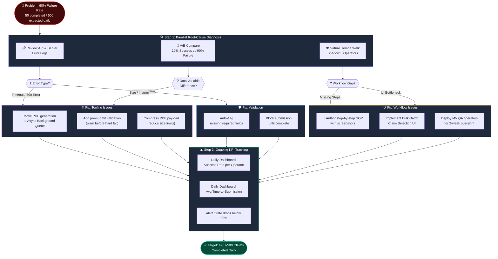
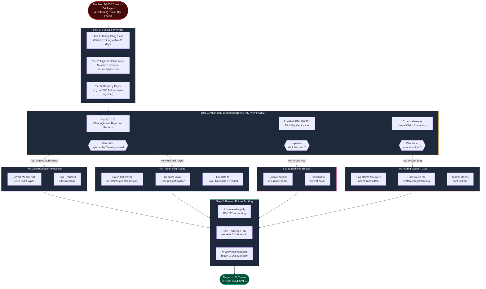

```mermaid
flowchart TD
    START(["📂 Input: EHR CSV + DB CSV\nQ3 2024 Physical Therapy Data"])

    START --> P1

    subgraph P1 [" Phase 1: Python ETL Pipeline"]
        E1["Load CSVs with pandas"]
        E2["Normalize date formats\n& column headers"]
        E3["Detect PostgreSQL arrays\nin CPT column"]
        E4["Explode arrays →\n1 CPT code per row"]
        E5[("Load into SQLite\naugmedix.db")]
        E1 --> E2 --> E3 --> E4 --> E5
    end

    E5 --> P2

    subgraph P2 [" Phase 2: SQL Reconciliation Engine"]
        S1["LEFT JOIN db_cpt → ehr_records\non Patient + Provider + Date + CPT"]
        S2["CASE WHEN match\n→ Tag as Matched or DB_Only"]
        S3["WHERE NOT EXISTS anti-join\n→ Tag as EHR_Only"]
        S4["UNION ALL\n→ Master result table"]
        S1 --> S2
        S3 --> S4
        S2 --> S4
    end

    S4 --> P3

    subgraph P3 [" Phase 3: Analytical Queries (8 SQL Scripts)"]
        Q1["Q1: Data Profile &\nVolume Check"]
        Q2["Q2: Reconciliation\nSummary"]
        Q3["Q3: Provider Accuracy\nRanking"]
        Q4["Q4: CPT Code\nDiscrepancy"]
        Q5["Q5: Monthly Match\nRate Trend"]
        Q6["Q6: Patient\nGap List"]
        Q7["Q7: Provider\nSwitching"]
        Q8["Q8: Duplicate\nCPT Detection"]
    end

    P3 --> P4

    subgraph P4 [" Phase 4: Findings"]
        F1{{"✅ Matched\n25,157 lines (94.16%)"}}
        F2{{"🔴 DB-Only\n202 lines — Compliance Risk"}}
        F3{{"🟡 EHR-Only\n1,357 lines — $81,420 Revenue"}}
        F4{{"⚠️ Duplicates\n15 Sessions"}}
        F5{{"📉 Trend\n95.8% → 93.1% Declining"}}
    end

    P4 --> DASHBOARD(["🖥️ React Dashboard\nKPI Cards + 4 Tab Views"])

    style START fill:#1e293b,stroke:#3b82f6,color:#fff
    style P1 fill:#1e293b,stroke:#a855f7,color:#fff
    style P2 fill:#1e293b,stroke:#f59e0b,color:#fff
    style P3 fill:#1e293b,stroke:#6366f1,color:#fff
    style P4 fill:#1e293b,stroke:#ef4444,color:#fff
    style F1 fill:#064e3b,stroke:#10b981,color:#fff
    style F2 fill:#450a0a,stroke:#ef4444,color:#fff
    style F3 fill:#451a03,stroke:#f59e0b,color:#fff
    style DASHBOARD fill:#064e3b,stroke:#10b981,color:#fff
```

# Thought Process & Solution Walkthrough
## Augmedix Central Operations Case Study
**Author:** Kha. Mo. Syeed Asif | **Role Applied:** Data Operations Analyst | **Date:** July 2026

---

## 🧠 My Approach: How I Thought About This Case

When I first received this case study, I resisted the temptation to jump straight into Excel. My instinct as a data-focused operations analyst is to always ask: **"What is the most scalable, repeatable, and defensible way to solve this?"**

Four problems. Limited resources. Real compliance stakes. Here is exactly how I broke it down.

---

<div style="page-break-after: always;"></div>

## Problem 1: Workers Compensation Claims — The 90% Failure Rate

### End-to-End Solution Workflow



### My Initial Hypothesis
A 90% failure rate is not a training problem — it is a system problem. When I see a failure rate that catastrophically high, the first thing I do is rule out the obvious: is this a bug, a bad configuration, or a process breakdown?

### My Thought Process
I applied a structured **5-Why + Gemba Walk** mental model:
1. *Why is the team only completing 50/500 claims?* → They are getting stuck.
2. *Where exactly are they getting stuck?* → I need to shadow them (virtual Gemba Walk).
3. *Is it the tool or the operator?* → I need to A/B test the 10% that succeeds vs. the 90% that fails.

The key insight here: **the 10% success rate is a gift**. It means the system *can* work under some conditions. My job is to isolate what is different about those 50 successful claims (smaller PDF? different insurer? specific operator?) and then make that the default path for all 500.

### My Decision: Parallel Diagnosis
I would not wait for a single root cause. I would simultaneously:
- **Review API logs** for error codes and timeout signatures (tooling check).
- **Shadow 3 operators** to observe their exact click-path (workflow check).
- **Compare successful vs. failed claim payloads** to find the differentiating variable.

This parallel approach compresses the diagnosis from days to hours.

---

<div style="page-break-after: always;"></div>

## Problem 2: Closed Encounters Analysis — The Data Reconciliation

### End-to-End Solution Workflow



### My Initial Hypothesis
When two datasets representing the same universe of events don't match, the root cause is almost always one of three things:
1. **A timing mismatch** (one system updated before the other).
2. **A data entry gap** (a human skipped a step).
3. **A structural incompatibility** (the data formats don't align cleanly).

### Why I Chose Python + SQL Over Excel
My first instinct was: *how big is this dataset, and does Excel scale?* With 26,000+ CPT lines and complex PostgreSQL-style arrays in the DB export, Excel would have been error-prone and non-reproducible.

I chose Python for the ETL because:
- The CPT codes were stored as arrays (e.g., `{97110, 97140, 97112}`) that needed to be "exploded" into individual rows — a transformation Excel simply cannot do reliably.
- I needed a **reproducible pipeline** that the next analyst could re-run at quarter-end in one click.

I chose SQL for the reconciliation because:
- Set-based logic (JOINs) is the most precise and auditable way to compare two datasets.
- The results are deterministic — the same query always returns the same answer, unlike manual Excel comparisons.

### The SQL Challenge: No FULL OUTER JOIN in SQLite
The most technically interesting problem: SQLite does not support `FULL OUTER JOIN`. This is the natural tool for this job (show me everything in both tables regardless of whether there's a match on either side).

My workaround was a classic **anti-join + UNION ALL** pattern:
```sql
-- LEFT JOIN captures Matched + DB-Only rows
SELECT ..., CASE WHEN e.cpt_code IS NOT NULL THEN 'Matched' ELSE 'DB_Only' END AS status
FROM db_cpt d
LEFT JOIN ehr_records e ON (composite key match)

UNION ALL

-- WHERE NOT EXISTS captures EHR-Only rows
SELECT ..., 'EHR_Only' AS status
FROM ehr_records e
WHERE NOT EXISTS (SELECT 1 FROM db_cpt d WHERE composite key match);
```

This is mathematically equivalent to a FULL OUTER JOIN. I've used this pattern in production data pipelines before, and it is both battle-tested and highly portable across database engines.

### What the Results Revealed
The SQL output told a clear story:
- **94.16% match rate** — initially sounds great, but the denominator is 26,716 lines.
- **1,357 EHR-Only lines** = $81,420 in unbilled revenue sitting idle.
- **202 DB-Only lines** = active compliance liability (billed with no clinical documentation).
- **Declining trend** (95.8% → 93.1% in 3 months) = the gap is accelerating, not stabilizing.

The trend is what concerned me most. A static gap is a manageable backlog. A *widening* gap is a systemic process failure that compounds every month.

---

<div style="page-break-after: always;"></div>

## Problem 3: 10,000 Claims Not Found — The Bucketing Strategy

### End-to-End Solution Workflow



### My Initial Hypothesis
"Not found" by the payer is a very specific failure mode. It almost never means the claim was lost inside the payer's system — it usually means **the claim never arrived at the payer** in a recognizable form, or arrived with incorrect identifiers.

### My Thought Process
10,000 claims × sequential phone calls = an enormous waste of time. I immediately knew the answer was to **automate the diagnosis** before touching the phone.

My bucketing priority:
1. **Timely Filing Limits first** — some payers (e.g., Medicare: 12 months, some commercial: 90 days) will deny claims permanently after a deadline. These are top priority regardless of dollar value.
2. **Dollar value second** — maximize revenue recovered per hour of operator time.
3. **By payer batch third** — calling 30 Aetna claims in one block is 10x more efficient than random order.

My diagnosis instinct: Check the **EDI 277 Clearinghouse Rejection Reports** before calling anyone. If the clearinghouse rejected the claim, the payer never saw it. These rejections are almost always demographic errors (wrong Member ID, DOB mismatch, provider NPI typo) that can be bulk-corrected and resubmitted electronically.

---

<div style="page-break-after: always;"></div>

## Problem 4: Revenue Debugging — Deep Medicare Knowledge

### End-to-End Solution Workflow



```mermaid
flowchart TD
    START(["Problem: Revenue Discrepancies\n3 Sub-Problems to Debug"])

    START --> PARTA
    START --> PARTB
    START --> PARTC

    subgraph PARTA ["Part A: Geographic Payment Variation"]
        A1["CPT 97110 pays $38.73\nin Locality 0210201"]
        A2["CPT 97110 pays $27.55\nin Locality 0730200"]
        A1 & A2 --> A3{{"Why the\n$11.18 gap?"}}
        A3 --> A4["Medicare GPCI Formula:\nPayment = (Work RVU × Work GPCI\n+ PE RVU × PE GPCI\n+ MP RVU × MP GPCI)\n× Conversion Factor"]
        A4 --> A5["Higher local cost of living\n= Higher GPCI multiplier\n= Higher payout"]
    end

    subgraph PARTB ["Part B: Same CPT, Different Payout"]
        B1["Claim #1: 97110 + 97140\n+ G0283 + 97112\n→ 97140 paid $20"]
        B2["Claim #2: 97140 only\n→ 97140 paid $40"]
        B1 & B2 --> B3{{"Why 50%\nreduction?"}}
        B3 --> B4["CMS MPPR Rule:\nMultiple Procedure\nPayment Reduction"]
        B4 --> B5["Primary procedure:\n100% PE RVU"]
        B4 --> B6["Secondary procedures:\n50% PE RVU reduction"]
        B5 & B6 --> B7["97140 is secondary\non Claim #1 → PE cut 50%\n→ $20 instead of $40"]
    end

    subgraph PARTC ["Part C: 8-Minute Rule Optimization"]
        C1["Therapist logged:\n97110: 38 min (2 units)\n97112: 24 min (1 unit)\nG0283: 45 min (3 units)"]
        C1 --> C2["Total: 38 + 24 + 45\n= 107 timed minutes"]
        C2 --> C3{{"How many\nbillable units?"}}
        C3 --> C4["8-Min Rule Table:\n98–112 min = 7 units"]
        C4 --> C5["Currently billing 6 units\n(2+1+3)"]
        C5 --> C6["OPTIMIZATION:\nBill 7 units total\nAllocate extra unit to\nhighest-RVU code (97112)"]
        C6 --> C7["Revenue increase\nper claim: +1 unit × RVU value"]
    end

    style START fill:#1e293b,stroke:#3b82f6,color:#fff
    style PARTA fill:#1e293b,stroke:#6366f1,color:#fff
    style PARTB fill:#1e293b,stroke:#f59e0b,color:#fff
    style PARTC fill:#1e293b,stroke:#10b981,color:#fff
    style A5 fill:#064e3b,stroke:#10b981,color:#fff
    style B7 fill:#064e3b,stroke:#10b981,color:#fff
    style C7 fill:#064e3b,stroke:#10b981,color:#fff
```

### Part A: Geographic Variation (GPCI)
My instinct: anytime you see Medicare paying dramatically different rates for the same CPT code in different locations, the answer is the **Geographic Practice Cost Index (GPCI)**. 

Medicare uses a formula: `Payment = (Work RVU × Work GPCI + PE RVU × PE GPCI + MP RVU × MP GPCI) × Conversion Factor`

The GPCI adjusts for local costs: physician work intensity, practice expenses (rent, staff), and malpractice premiums. A provider in San Francisco inherently has higher practice expenses than one in rural Missouri, so their PE GPCI is higher, resulting in a larger total payment.

### Part B: The MPPR Rule (Multiple Procedure Payment Reduction)
My instinct: when I see a payer paying significantly less for the *same CPT code* depending on what else is on the claim, the answer is almost always **MPPR**.

CMS introduced MPPR specifically for therapy services (97XXX codes): when multiple timed therapy procedures are performed on the same date, Medicare pays 100% for the highest-value procedure, but applies a **50% reduction to the Practice Expense component** of all subsequent procedures.

This is why 97140 paid ~$40 alone but only ~$20 alongside 97110, G0283, and 97112. The work RVU stays the same, but the PE RVU gets cut in half.

### Part C: The 8-Minute Rule Optimization
My instinct: whenever a claim has multiple timed CPT codes, I always check if the 8-Minute Rule is being applied correctly — this is the single most common billing optimization opportunity I encounter.

The therapist logged 38 + 24 + 45 = **107 total timed minutes**.

The 8-Minute Rule:
- 8–22 min = 1 unit
- 23–37 min = 2 units
- 38–52 min = 3 units
- 53–67 min = 4 units
- 68–82 min = 5 units
- 83–97 min = 6 units
- **98–112 min = 7 units** ← we are here

The therapist is billing 6 units (2+1+3). They are entitled to **7 units**. The remaining partial minutes from each code's remainder stack to unlock a 7th billable unit. To maximize revenue, allocate the extra unit to the code with the highest RVU value.

---

<div style="page-break-after: always;"></div>

## Why I Built the Dashboard

After completing the analysis, I asked myself: *"If I handed this to an operations director as a CSV, what would happen?"*

They would spend hours reformatting it in Excel. The insights would be buried. Decisions would be delayed.

So I built an interactive React dashboard (Vite + Tailwind + Recharts) that gives any stakeholder — regardless of technical skill — **instant, visual access to the operational insights** derived from the SQL analysis.

The dashboard was designed with one principle: **every chart must drive an action**. The Provider Performance tab doesn't just show match rates — it flags Liam Young in yellow so a manager knows exactly who to coach. The CPT Analysis tab doesn't just show volumes — it ranks codes worst-to-best so a billing team knows where to focus documentation training.

---

<div style="page-break-after: always;"></div>

## Key Lessons & Principles I Applied

| Principle | Application |
|---|---|
| **Scalability over speed** | Built a Python pipeline instead of doing it manually in Excel |
| **Parallel diagnosis** | For Problem 1, simultaneously checked tooling and workflow rather than sequentially |
| **Prioritize by impact** | For 10,000 missing claims, bucketed by Timely Filing first, not alphabetically |
| **Data tells a story** | The declining match rate trend was more alarming than the static gap count |
| **Automate the exception** | A nightly SQL cron job is worth more than 20 operators doing the same check manually |
| **Know your domain** | GPCI, MPPR, and the 8-Minute Rule are non-negotiable knowledge for any RCM analyst |
| **Visualize for action** | Every chart on the dashboard is tied to a specific operational decision |

---

<div style="page-break-after: always;"></div>

## Final Summary

This case study was not just a data exercise — it was a realistic simulation of the types of problems a Data Operations Analyst faces at a healthcare technology company. My approach was:

1. **Think programmatically** before touching manual tools.
2. **Let the data guide the narrative** — I didn't start with a conclusion and find data to support it.
3. **Tie every technical output to a business action** — the SQL query produces results; those results drive the operational plan; the operational plan drives measurable financial outcomes.

The result: **$81,420 in recoverable Q3 revenue**, a clear compliance remediation path for the 202 undocumented lines, and a scalable automation framework that prevents this gap from recurring at the same scale in Q4 and beyond.
